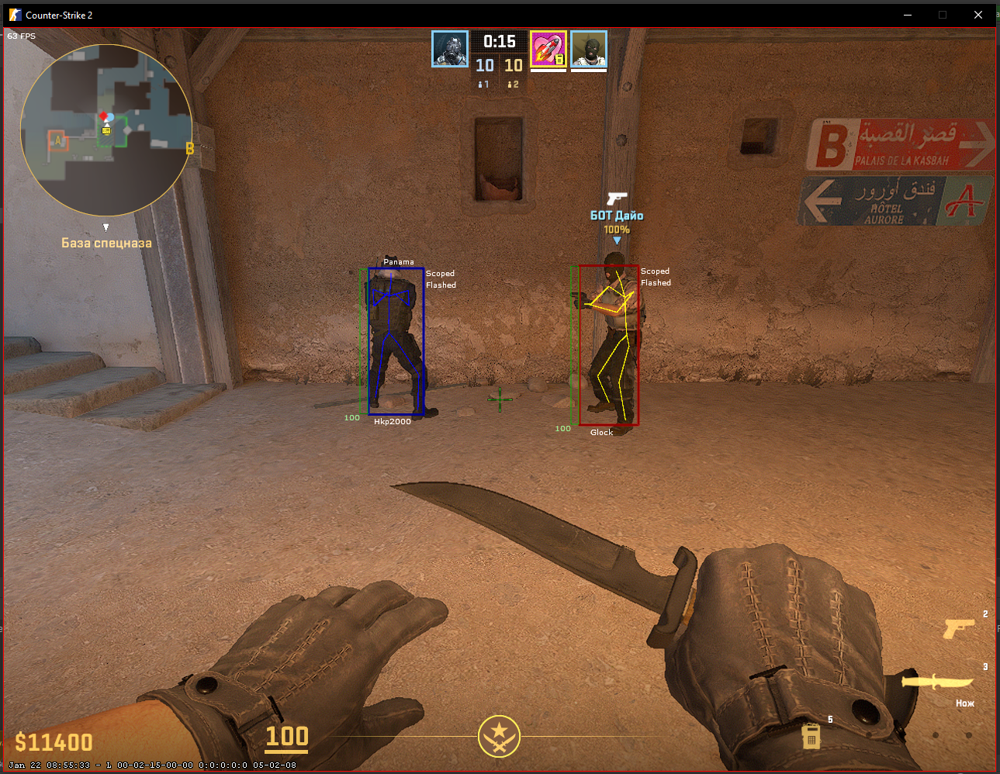

## FullyExternalCS2

### Description

FullyExternalCS2 is an external cheat for Counter-Strike 2 **that does not write to the game memory**. \
It was created for the _purpose_ of _improving_ Windows API skills. \
[Please note that.](https://github.com/sweeperxz/FullyExternalCS2/issues/6#issuecomment-1919053959)



### Features

#### AimBot
- Key activation with RCS (default = LBUTTON)
- Visibility check

#### Esp
- Skeleton (Color team)
- Box with health bar
- Health numbers
- Name
- Enemy weapon
- Enemy flags (Scoped, Flashed, Shifting, Shifting in scope)

#### Other Visuals
- Aim Crosshair

#### Trigger Bot
- Key activation (default = LAlt)

#### Miscellaneous
- BunnyHop ([Read this](https://github.com/sweeperxz/FullyExternalCS2/blob/31f90c2fe4825ac86ba6862531dc633ab6d3aef0/Data/Player.cs#L60))
- OBS Bypass

#### System
- Auto update offsets

### Getting started

**Dependencies**

```cs
    <ItemGroup>
        <PackageReference Include="GameOverlay.Net" Version="4.3.1"/>
        <PackageReference Include="Overlay.NET" Version="1.0.2"/>
        <PackageReference Include="PresentationFramework" Version="4.6.0"/>
        <PackageReference Include="SharpDX.Direct3D9" Version="4.2.0"/>
        <PackageReference Include="SharpDX.DXGI" Version="4.2.0"/>
    </ItemGroup>
```

**Installation**

```bash
git clone https://github.com/sweeperxz/FullyExternalCS2.git
cd FullyExternalCS2
```

### Starting the program

```bash
dotnet build
dotnet run
```

### Help

If you have issues or have questions, check out the Issues section of the GitHub project page.

### Authors

- sweeperxz - Developer/Engineer

## Star History

[](https://star-history.com/#sweeperxz/FullyExternalCS2&Date)

