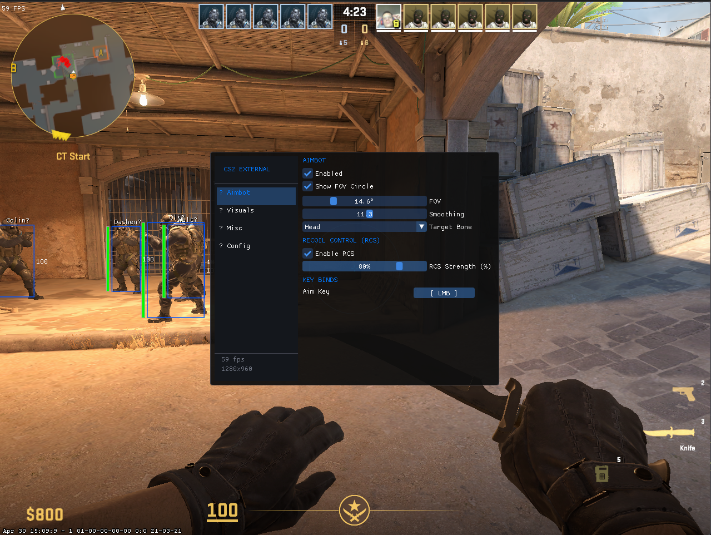

# FullyExternalCS2 v2.0



FullyExternalCS2 v2.0 is a refreshed external CS2 project with a new ImGui overlay, built-in menu, live configuration, updated visuals, RCS improvements, Bomb Timer, Vote Teller, and cleaner feature control directly from the overlay.

The main focus of this version is the new in-game menu: most features no longer need to be edited manually in `config.json`; they can be enabled, disabled, tuned, saved, reloaded, and reset from the overlay.

## What's new in v2.0

- New ImGui-based overlay menu
- Tabbed interface for Aimbot, Visuals, Misc, and Config
- Built-in keybind editor
- Config save, reload, and reset buttons
- Live feature toggles from the menu
- Updated ESP settings
- Weapon text display for enemies
- ESP flags moved into the menu
- Improved RCS behavior
- Aim FOV circle and smoothing control
- Selectable aimbot target bone
- Bomb Timer update
- New Vote Teller feature
- Auto-loaded offsets from cs2-dumper

## Menu

The cheat now includes a full overlay menu.

Default menu key: `Insert`

### Aimbot tab

- Enable or disable Aimbot
- Show or hide FOV Circle
- Change Aim FOV
- Change Aim Smoothing
- Select Target Bone: Head, Neck, Chest, Pelvis
- Enable or disable RCS
- Change RCS Strength
- Change Aim Key

### Visuals tab

- ESP Box
- ESP Name
- ESP Weapon text
- ESP Flags
- Box color picker
- Skeleton ESP
- Aim Crosshair
- Bomb Timer
- Vote Teller

### Misc tab

- TriggerBot
- TriggerBot keybind
- Team Check
- Menu keybind

### Config tab

- Save Config
- Reload Config
- Reset Defaults
- Game status information
- Overlay FPS and resolution information

## Features

### Aimbot

- Key activation
- Visibility check
- Adjustable FOV
- Adjustable smoothing
- Target bone selection
- FOV circle
- Recoil Control System
- RCS strength slider

Default aim key: `LButton`

### ESP

- Box ESP
- Health bar
- Health numbers
- Player name
- Current weapon text
- Enemy flags:
  - Scoped
  - Flashed
  - Shifting
  - Shifting in scope
- Skeleton ESP
- Team Check
- Custom box color

### World visuals

- Bomb Timer
- Vote Teller
- Aim Crosshair

### TriggerBot

- Key activation
- Configurable keybind

Default trigger key: `LAlt`

### Config system

- `config.json` is created automatically
- Settings can be changed from the menu
- Config can be saved from the menu
- Config can be reloaded while the program is running
- Defaults can be restored from the menu
- Keybinds are stored in config

### System

- Auto update offsets
- External overlay
- Does not write to game memory
- Built on .NET 8
- Uses ClickableTransparentOverlay and ImGuiNET

## Default keys

| Action | Default key |
| --- | --- |
| Open menu | Insert |
| Aimbot | LButton |
| TriggerBot | LAlt |

## Requirements

- Windows
- .NET 8 SDK
- Counter-Strike 2

## Dependencies

```xml
<ItemGroup>
    <PackageReference Include="ClickableTransparentOverlay" Version="11.1.0"/>
    <PackageReference Include="Newtonsoft.Json" Version="13.0.3"/>
    <PackageReference Include="Process.NET" Version="1.0.2"/>
</ItemGroup>
```

## Installation

```bash
git clone https://github.com/sweeperxz/FullyExternalCS2.git
cd FullyExternalCS2
```

## Starting the program

```bash
dotnet build
dotnet run
```

## Notes

FullyExternalCS2 was created for learning and improving Windows API, overlay, and external memory-reading skills.

Use at your own risk.

## Authors

- sweeperxz - Developer/Engineer
